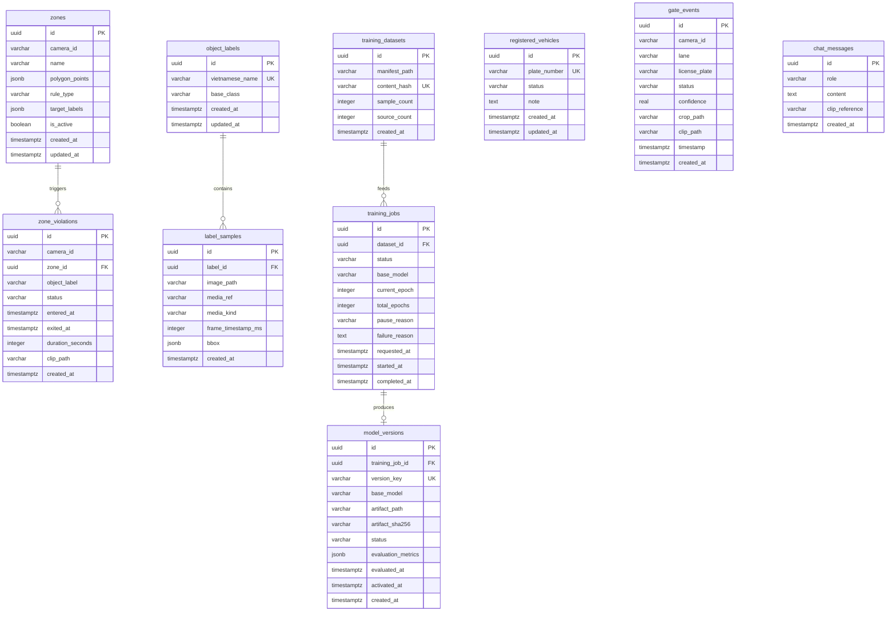

# SentriAI — Database Specification

## 1. Scope and Sources

**Product:** `docs/product/product.md` — Đã duyệt, gồm extension `ext-20260820-object-detection-training` r1 (HuuThuan, 2026-08-20)
**Architecture:** `docs/architecture/architecture.md` — Đã duyệt, gồm extension `ext-20260820-object-detection-training` r1 (2026-08-20)
**Database engine:** PostgreSQL (Neon cloud, phiên bản 15/16)  
**Existing schema sources:** `backend/node-api/prisma/schema.prisma`; `backend/node-api/prisma/migrations/20260817132004_init_sentriai`, `20260817202202_add_check_constraints`, `20260818150000_zone_violations_delete_cascade`

**Database delta approval:** HuuThuan — explicit chat approval, 2026-08-20.

**In scope:**
- Lưu trữ danh mục biển số xe đã đăng ký và phân loại quen/lạ phục vụ đối chiếu LPR (M1, M3).
- Lưu trữ lịch sử sự kiện nhận diện xe tại cổng ra vào kèm ảnh cắt biển số và clip 10s (M1).
- Lưu trữ cấu hình vùng giám sát đa giác (polygon), quy tắc cấm/cho phép đối tượng theo camera (M2, M3).
- Lưu trữ sự kiện vi phạm khu vực (thời điểm vào/ra, duration, clip 10s) (M2).
- Lưu trữ danh mục nhãn đối tượng tiếng Việt và mẫu ảnh/annotation gán nhãn (M3).
- Lưu snapshot dataset, training job và version model đánh giá được cho fine-tune thủ công từ mẫu nhãn (M3 extension).
- Lưu trữ lịch sử câu hỏi/trả lời của trợ lý AI Q&A kèm tham chiếu clip (M4).

**Out of scope:**
- Phân quyền người dùng, bảng phân vai trò (Admin / Bảo vệ / Viewer) — MVP là single user local.
- Làn xe ra (OUT lane), bảng phân ca trực bảo vệ.
- Quản lý đa tổ chức / multi-site (multi-tenancy).
- Cloud training, tự động train sau mỗi lần lưu mẫu, hoặc tự động kích hoạt candidate model.

---

## 2. Resolved Decisions

1. **Cấu trúc sự kiện:** Tách thành 2 bảng chuyên biệt `gate_events` và `zone_violations` để đảm bảo kiểu dữ liệu chặt chẽ và tối ưu truy vấn nghiệp vụ.
2. **Cấu trúc Zone & Rules:** Lưu tập trung tọa độ polygon và cấu hình quy tắc trong bảng `zones` dưới dạng `jsonb` để hỗ trợ đẩy cấu hình real-time và nạp nhanh vào Python Worker/React Canvas.
3. **Lưu trữ Chat Q&A:** Thêm bảng `chat_messages` để lưu trữ bền vững lịch sử hỏi đáp AI và đường dẫn clip tham chiếu.
4. **`object_labels.base_class` không unique:** Nhiều tên tiếng Việt (e.g. "Xe máy" và "Mô tô") có thể cùng map về một class YOLO gốc (e.g. `motorcycle`). Không thêm unique constraint trên `base_class`; Python Worker sử dụng `vietnamese_name` làm khóa tra cứu trong zone rules.
5. **Lịch sử chat hiển thị toàn bộ:** `chat_messages` lưu bền vững và hiển thị toàn bộ lịch sử qua các phiên khác nhau; không có `session_id`.
6. **Snapshot dataset bất biến:** Một `training_dataset` chỉ lưu manifest local và hash, không FK từng sample. Xóa/sửa nhãn sau đó không được thay đổi tập dùng để train/evaluate một version đã tạo.
7. **Một custom candidate cho một job:** `model_versions.training_job_id` unique; job chỉ tạo tối đa một candidate version. `model_versions.status = 'ACTIVE'` được bảo vệ bằng partial unique index để chỉ có một custom augmentation đang bật. Base YOLO không phải record bị thay thế và luôn chạy cho các class COCO.
8. **Nguồn sample phải truy xuất lại được:** Mỗi `label_samples` lưu `media_ref`, loại media và timestamp frame (với video) ngoài bbox. `image_path` được giữ tương thích dữ liệu cũ, không còn là source of truth cho export dataset.

---

## 3. Logical Data Model

### RegisteredVehicle (Xe đăng ký)
- **Purpose:** Quản lý danh sách biển số đã biết để hệ thống đối chiếu gán nhãn `XE QUEN` hoặc `XE LẠ` khi xe vào cổng.
- **Owner/tenant:** Toàn hệ thống (single-tenant).
- **Identity:** Biển số xe (`plate_number`, unique).
- **Lifecycle:** Tạo/sửa/xóa thủ công từ màn hình Cài đặt (M3).
- **Relationships:** Đối chiếu logic với `gate_events` (không ép foreign key để tránh việc xóa xe làm mất tính toàn vẹn của log sự kiện cũ).
- **Source:** Product M1, M3; Rule BR-02.

### GateEvent (Sự kiện cổng)
- **Purpose:** Ghi nhận mỗi lượt xe đi vào làn IN tại cổng (biển số, độ tin cậy, phân loại quen/lạ, ảnh crop, video clip 10s).
- **Owner/tenant:** Camera GATE-01.
- **Identity:** Khóa chính định danh sự kiện (`id`).
- **Lifecycle:** Python Worker tạo mới khi xe vào zone làn IN; không sửa/xóa (append-only log).
- **Relationships:** Độc lập với bảng cấu hình xe.
- **Source:** Product M1, AC-02, BR-01, BR-05.

### Zone (Vùng giám sát & Quy tắc)
- **Purpose:** Định nghĩa các đa giác khu vực trên khung hình camera kèm danh sách quy tắc cấm/cho phép loại đối tượng.
- **Owner/tenant:** Gắn theo Camera (`camera_id` ví dụ: `BAI-KIEM`, `GATE-01`).
- **Identity:** Khóa chính `id` (UUID).
- **Lifecycle:** Tạo, sửa tọa độ/rules, bật/tắt kích hoạt từ màn hình Cài đặt (M3).
- **Relationships:** 1 Zone có thể có nhiều `zone_violations` (1:N).
- **Source:** Product M2, M3, BR-03, BR-04, BR-07.

### ZoneViolation (Sự kiện vi phạm khu vực)
- **Purpose:** Ghi nhận phiên đối tượng đi vào vùng cấm từ lúc vào đến lúc ra, tổng thời gian và clip 10s.
- **Owner/tenant:** Gắn với một Zone và Camera cụ thể.
- **Identity:** Khóa chính `id` (UUID).
- **Lifecycle:** Python Worker tạo khi phát hiện vi phạm (`status = 'OPEN'`), cập nhật `exited_at` + `duration_seconds` + `status = 'CLOSED'` khi đối tượng rời zone.
- **Relationships:** N:1 với `zones`.
- **Source:** Product M2, AC-04, BR-05, BR-06.

### ObjectLabel (Danh mục nhãn đối tượng)
- **Purpose:** Định nghĩa tên tiếng Việt tương ứng với các class gốc của model YOLO (ví dụ: `xe_nang` -> "Xe nâng").
- **Owner/tenant:** Toàn hệ thống.
- **Identity:** `vietnamese_name` (unique).
- **Lifecycle:** Tạo/sửa/xóa từ màn hình Cài đặt gán nhãn (M3).
- **Relationships:** 1 ObjectLabel có nhiều `label_samples` (1:N).
- **Source:** Product M3, AC-06; Q2.

### LabelSample (Mẫu ảnh gán nhãn)
- **Purpose:** Lưu trữ đường dẫn ảnh và tọa độ bounding box đã vẽ phục vụ lưu trữ tập dữ liệu mẫu.
- **Owner/tenant:** Thuộc về một `ObjectLabel`.
- **Identity:** Khóa chính `id` (UUID).
- **Lifecycle:** Tạo từ tool vẽ bbox gán nhãn (M3), xóa khi xóa nhãn cha (cascade).
- **Relationships:** N:1 với `object_labels`.
- **Source:** Product M3, Mục 8 Success metrics (>= 20 mẫu/loại).

### TrainingDataset (Snapshot dataset huấn luyện)
- **Purpose:** Giữ định danh bất biến, manifest và hash của đúng tập sample đã export để một lần train/evaluate có thể tái lập.
- **Owner/tenant:** Toàn hệ thống (single-tenant).
- **Identity:** Khóa chính UUID; `content_hash` unique cho nội dung manifest.
- **Lifecycle:** Tạo khi người dùng bắt đầu train và exporter đã xác thực sample; không sửa/xóa trong MVP.
- **Relationships:** Một TrainingDataset có thể được dùng bởi nhiều TrainingJob; không liên kết FK từng LabelSample vì snapshot phải bền vững khi nhãn nguồn thay đổi.
- **Source:** Product extension BR-10/BR-11; Architecture §11; REQUIRED_DERIVATION để giữ dataset snapshot bất biến.

### TrainingJob (Lần huấn luyện)
- **Purpose:** Lưu vòng đời, tiến độ và lỗi/pause của một yêu cầu train thủ công; đây là trạng thái để UI và Node/Python runner phối hợp an toàn.
- **Owner/tenant:** Toàn hệ thống (single-tenant).
- **Identity:** Khóa chính UUID.
- **Lifecycle:** `QUEUED` → `RUNNING` ↔ `PAUSED_GPU` → `EVALUATING` → `SUCCEEDED` hoặc `FAILED`; không xóa trong MVP để báo cáo version còn truy vết được.
- **Relationships:** N:1 với TrainingDataset; 1:0..1 với ModelVersion.
- **Source:** Product extension AC-10/AC-11, BR-11; Architecture §11 GPU governor.

### ModelVersion (Version model nhận diện)
- **Purpose:** Đăng ký artifact custom, kết quả evaluation và trạng thái candidate/active để activation/rollback chỉ thay lớp bổ sung, không ghi đè base YOLO đang chạy.
- **Owner/tenant:** Toàn hệ thống (single-tenant).
- **Identity:** Khóa chính UUID; `version_key` unique, artifact định danh bằng checksum SHA-256.
- **Lifecycle:** Job thành công tạo custom version; custom version đi `CANDIDATE` → `ACTIVE` hoặc `INACTIVE`/`REJECTED`. Kích hoạt một version chuyển custom version active hiện tại thành `INACTIVE` trong cùng transaction; rollback tắt custom version và base YOLO vẫn tiếp tục. Không xóa trong MVP.
- **Relationships:** 1:1 với TrainingJob; không FK trực tiếp ObjectLabel/LabelSample vì version luôn tham chiếu dataset snapshot qua job.
- **Source:** Product extension AC-11, BR-11; Architecture §11; REQUIRED_DERIVATION cho atomic activation và rollback.

### ChatMessage (Lịch sử hỏi đáp AI)
- **Purpose:** Lưu lại lịch sử câu hỏi của người dùng và câu trả lời kèm tham chiếu video clip từ Gemini Q&A.
- **Owner/tenant:** Toàn hệ thống.
- **Identity:** Khóa chính `id` (UUID).
- **Lifecycle:** Tạo mới khi user gửi câu hỏi và khi AI hoàn thành câu trả lời (append-only).
- **Relationships:** Độc lập.
- **Source:** Product M4, Q&A Chat.

---

## 4. Mermaid ERD

---

## 5. Table Specifications

### `registered_vehicles`

**MVP justification:** Quản lý danh sách biển số để hệ thống phân biệt `XE QUEN` và `XE LẠ` theo Product M1, M3.  
**Owner/tenant:** System-wide (Single-tenant).  
**Lifecycle:** Thêm, sửa trạng thái/ghi chú, xóa từ UI Cài đặt.

| Column | Engine type | Null | Default | Key | Meaning/source |
|---|---|---|---|---|---|
| `id` | `uuid` | No | `gen_random_uuid()` | PK | Định danh bản ghi |
| `plate_number` | `varchar(20)` | No | None | UK | Biển số xe (chuẩn hóa không dấu, viết hoa) |
| `status` | `varchar(20)` | No | `'KNOWN'` | | Phân loại: `'KNOWN'` (Xe quen), `'STRANGER'` (Xe lạ) |
| `note` | `text` | Yes | `NULL` | | Ghi chú người sở hữu / loại xe |
| `created_at` | `timestamptz` | No | `now()` | | Thời điểm đăng ký |
| `updated_at` | `timestamptz` | No | `now()` | | Thời điểm cập nhật cuối |

- **Primary key:** `id`
- **Unique constraints:** `uq_registered_vehicles_plate_number` (`plate_number`)
- **Check constraints:** `chk_registered_vehicles_status`: `status IN ('KNOWN', 'STRANGER')`
- **Indexes:** Backing unique index trên `plate_number` (phục vụ đối chiếu LPR tốc độ cao theo **AP-01**).
- **Sensitive-data notes:** Biển số xe nội bộ; lưu trữ trực tiếp.

---

### `gate_events`

**MVP justification:** Ghi nhật ký mọi lượt xe qua cổng kèm ảnh cắt và clip 10s theo Product M1 (AC-02).  
**Owner/tenant:** Gắn theo camera cổng (`GATE-01`).  
**Lifecycle:** Append-only log. Được tạo bởi Python AI Worker khi xe đi qua làn IN.

| Column | Engine type | Null | Default | Key | Meaning/source |
|---|---|---|---|---|---|
| `id` | `uuid` | No | `gen_random_uuid()` | PK | Định danh sự kiện cổng |
| `camera_id` | `varchar(50)` | No | None | | Mã định danh camera (`'GATE-01'`) — Worker phải truyền tường minh |
| `lane` | `varchar(20)` | No | None | | Làn xe di chuyển: `'IN_1'`, `'IN_2'` |
| `license_plate` | `varchar(20)` | No | None | | Biển số xe nhận diện được |
| `status` | `varchar(20)` | No | None | | Trạng thái đối chiếu: `'KNOWN'` hoặc `'STRANGER'` |
| `confidence` | `real` | No | None | | Độ tin cậy nhận diện OCR (0.0 đến 1.0) |
| `crop_path` | `varchar(500)` | Yes | `NULL` | | Đường dẫn file ảnh cắt biển số trên disk |
| `clip_path` | `varchar(500)` | Yes | `NULL` | | Đường dẫn file video MP4 10s trên disk |
| `timestamp` | `timestamptz` | No | `now()` | | Thời điểm xe xuất hiện trong zone |
| `created_at` | `timestamptz` | No | `now()` | | Thời điểm ghi bản ghi vào DB |

- **Primary key:** `id`
- **Foreign keys:** None (để log sự kiện độc lập)
- **Check constraints:**
  - `chk_gate_events_lane`: `lane IN ('IN_1', 'IN_2')`
  - `chk_gate_events_status`: `status IN ('KNOWN', 'STRANGER')`
  - `chk_gate_events_confidence`: `confidence >= 0.0 AND confidence <= 1.0`
- **Indexes:**
  - `idx_gate_events_timestamp_desc` (`timestamp DESC`) — phục vụ **AP-02** (Alert panel & Live query).
  - `idx_gate_events_license_plate` (`license_plate`) — phục vụ **AP-03** (Tra cứu theo biển số).
  - `idx_gate_events_status_timestamp` (`status`, `timestamp DESC`) — phục vụ **AP-04** (AI Q&A: đếm xe lạ hôm nay).
- **Sensitive-data notes:** Đường dẫn media trỏ tới filesystem local (`data/crops/`, `data/clips/`).

---

### `zones`

**MVP justification:** Quản lý tọa độ đa giác và quy tắc kiểm tra vi phạm theo Product M2, M3.  
**Owner/tenant:** Thuộc camera tương ứng (`camera_id`).  
**Lifecycle:** Tạo, chỉnh sửa, bật/tắt từ màn hình Cài đặt (M3).

| Column | Engine type | Null | Default | Key | Meaning/source |
|---|---|---|---|---|---|
| `id` | `uuid` | No | `gen_random_uuid()` | PK | Định danh vùng giám sát |
| `camera_id` | `varchar(50)` | No | None | | Camera áp dụng (`BAI-KIEM`, `GATE-01`) |
| `name` | `varchar(100)` | No | None | | Tên vùng (ví dụ: "Khu vực cấm xe máy") |
| `polygon_points` | `jsonb` | No | None | | Danh sách tọa độ normalized: `[{"x":0.1,"y":0.2},...]` |
| `rule_type` | `varchar(50)` | No | `'PROHIBIT_SPECIFIED'` | | Kiểu quy tắc: `'PROHIBIT_SPECIFIED'` (cấm danh sách chỉ định), `'ALLOW_SPECIFIED'` (chỉ cho phép danh sách, còn lại cấm) |
| `target_labels` | `jsonb` | No | `'[]'::jsonb` | | Danh sách nhãn đối tượng áp dụng rule: `["xe_may", "nguoi"]` |
| `is_active` | `boolean` | No | `true` | | Trạng thái kích hoạt giám sát |
| `created_at` | `timestamptz` | No | `now()` | | Thời điểm tạo |
| `updated_at` | `timestamptz` | No | `now()` | | Thời điểm cập nhật cuối |

- **Primary key:** `id`
- **Unique constraints:** `uq_zones_camera_name` (`camera_id`, `name`) — tránh 2 zone trùng tên trên cùng camera; bắt buộc khi UI dùng tên zone để phân biệt.
- **Check constraints:** `chk_zones_rule_type`: `rule_type IN ('PROHIBIT_SPECIFIED', 'ALLOW_SPECIFIED')`
- **Indexes:**
  - `idx_zones_camera_active` (`camera_id`, `is_active`) — phục vụ **AP-05** (Python Worker nạp zone đang active).
- **Sensitive-data notes:** None.

---

### `zone_violations`

**MVP justification:** Ghi nhận sự kiện vi phạm khu vực (thời điểm vào/ra, duration, clip 10s) theo Product M2.  
**Owner/tenant:** Thuộc về một `Zone` và `Camera`.  
**Lifecycle:** Tạo khi đối tượng vào vùng cấm (`status = 'OPEN'`), cập nhật `exited_at` + `duration_seconds` + `status = 'CLOSED'` khi đối tượng ra khỏi vùng.

| Column | Engine type | Null | Default | Key | Meaning/source |
|---|---|---|---|---|---|
| `id` | `uuid` | No | `gen_random_uuid()` | PK | Định danh sự kiện vi phạm |
| `camera_id` | `varchar(50)` | No | None | | Mã camera xảy ra vi phạm (`'BAI-KIEM'`) — Worker phải truyền tường minh |
| `zone_id` | `uuid` | No | None | FK | Vùng giám sát bị vi phạm |
| `object_label` | `varchar(100)` | No | None | | Tên nhãn đối tượng vi phạm (hoặc `'CHƯA XÁC ĐỊNH'`) |
| `status` | `varchar(20)` | No | `'OPEN'` | | Trạng thái sự kiện: `'OPEN'` (đang ở trong zone), `'CLOSED'` (đã rời khỏi zone) |
| `entered_at` | `timestamptz` | No | `now()` | | Thời điểm đối tượng đi vào zone |
| `exited_at` | `timestamptz` | Yes | `NULL` | | Thời điểm đối tượng rời khỏi zone |
| `duration_seconds` | `integer` | Yes | `NULL` | | Tổng thời gian lưu lại trong zone (giây) |
| `clip_path` | `varchar(500)` | Yes | `NULL` | | Đường dẫn video MP4 10s lưu từ lúc vào |
| `created_at` | `timestamptz` | No | `now()` | | Thời điểm tạo bản ghi |

- **Primary key:** `id`
- **Foreign keys:** `fk_zone_violations_zone_id`: `zone_id` REFERENCES `zones(id)` ON DELETE RESTRICT ON UPDATE CASCADE
- **Check constraints:**
  - `chk_zone_violations_status`: `status IN ('OPEN', 'CLOSED')`
  - `chk_zone_violations_duration`: `duration_seconds IS NULL OR duration_seconds >= 0`
- **Indexes:**
  - `idx_zone_violations_entered_at_desc` (`entered_at DESC`) — phục vụ **AP-02** (Alert panel & Timeline).
  - `idx_zone_violations_zone_entered` (`zone_id`, `entered_at DESC`) — phục vụ **AP-06** (AI Q&A: tra cứu vi phạm theo zone).
  - `idx_zone_violations_active_tracking` (`zone_id`, `status`) — phục vụ Python Worker kiểm tra vi phạm đang mở để tránh spam alert lặp (BR-06).
- **Sensitive-data notes:** Clip trỏ tới filesystem local (`data/clips/`).

---

### `object_labels`

**MVP justification:** Quản lý danh mục tên tiếng Việt ánh xạ tới class model gốc theo Product M3 (Q2, AC-06).  
**Owner/tenant:** Toàn hệ thống.  
**Lifecycle:** Thêm/sửa/xóa từ UI Cài đặt gán nhãn.

| Column | Engine type | Null | Default | Key | Meaning/source |
|---|---|---|---|---|---|
| `id` | `uuid` | No | `gen_random_uuid()` | PK | Định danh nhãn |
| `vietnamese_name` | `varchar(100)` | No | None | UK | Tên nhãn tiếng Việt (ví dụ: "Xe máy", "Xe nâng") |
| `base_class` | `varchar(50)` | No | None | | Class tương ứng trong model gốc (ví dụ: "motorcycle", "truck") |
| `created_at` | `timestamptz` | No | `now()` | | Thời điểm tạo |
| `updated_at` | `timestamptz` | No | `now()` | | Thời điểm cập nhật |

- **Primary key:** `id`
- **Unique constraints:** `uq_object_labels_vietnamese_name` (`vietnamese_name`)
- **Indexes:** Backing index unique trên `vietnamese_name`.
- **Sensitive-data notes:** None.

---

### `label_samples`

**MVP justification:** Lưu trữ các mẫu ảnh và tọa độ bbox đã gắn nhãn trong màn hình Cài đặt theo Product M3.  
**Owner/tenant:** Thuộc về một `ObjectLabel`.  
**Lifecycle:** Thêm từ UI gán nhãn; tự động xóa nếu nhãn cha bị xóa (Cascade).

| Column | Engine type | Null | Default | Key | Meaning/source |
|---|---|---|---|---|---|
| `id` | `uuid` | No | `gen_random_uuid()` | PK | Định danh mẫu gán nhãn |
| `label_id` | `uuid` | No | None | FK | Nhãn đối tượng được gán |
| `image_path` | `varchar(500)` | Yes | `NULL` | | Đường dẫn raster đã trích nếu có; compatibility field, không dùng làm nguồn export |
| `media_ref` | `varchar(500)` | No | None | | Định danh/đường dẫn local do server tạo tới media gốc đã upload |
| `media_kind` | `varchar(10)` | No | None | | `'IMAGE'` hoặc `'VIDEO'`; quyết định cách dataset exporter đọc media |
| `frame_timestamp_ms` | `integer` | Yes | `NULL` | | Timestamp frame đã chọn, bắt buộc với `media_kind = 'VIDEO'`, bằng `NULL` với ảnh |
| `bbox` | `jsonb` | No | None | | Tọa độ bbox: `{"x": 0.1, "y": 0.2, "w": 0.3, "h": 0.4}` |
| `created_at` | `timestamptz` | No | `now()` | | Thời điểm gán nhãn |

- **Primary key:** `id`
- **Foreign keys:** `fk_label_samples_label_id`: `label_id` REFERENCES `object_labels(id)` ON DELETE CASCADE ON UPDATE CASCADE
- **Indexes:**
  - `idx_label_samples_label_id` (`label_id`) — lọc các mẫu theo nhãn khi mở màn hình gán nhãn, phục vụ **AP-07**.
- **Check constraints:**
  - `chk_label_samples_media_kind`: `media_kind IN ('IMAGE', 'VIDEO')`.
  - `chk_label_samples_frame_timestamp`: (`media_kind = 'VIDEO' AND frame_timestamp_ms >= 0`) OR (`media_kind = 'IMAGE' AND frame_timestamp_ms IS NULL`).
- **Sensitive-data notes:** None.

---

### `training_datasets`

**MVP justification:** Product extension yêu cầu export dataset bất biến từ mẫu đã gán nhãn trước khi train/evaluate; cần giữ nguồn tái lập cho candidate model.
**Owner/tenant:** System-wide (single-tenant).
**Lifecycle:** Tạo duy nhất sau export thành công; immutable và không xóa trong MVP.

| Column | Engine type | Null | Default | Key | Meaning/source |
|---|---|---|---|---|---|
| `id` | `uuid` | No | `gen_random_uuid()` | PK | Định danh snapshot dataset |
| `manifest_path` | `varchar(500)` | No | None | | Relative path local tới manifest/export đã hoàn tất |
| `content_hash` | `varchar(64)` | No | None | UK | SHA-256 của manifest/content snapshot, chống nhầm artifact |
| `sample_count` | `integer` | No | None | | Số annotation hợp lệ được export |
| `source_count` | `integer` | No | None | | Số image/video source độc lập, phục vụ split theo source |
| `created_at` | `timestamptz` | No | `now()` | | Thời điểm snapshot hoàn tất |

- **Primary key:** `id`.
- **Foreign keys:** None; manifest là snapshot độc lập với sample nguồn.
- **Unique constraints:** `uq_training_datasets_content_hash` (`content_hash`).
- **Check constraints:** `chk_training_datasets_counts`: `sample_count > 0 AND source_count > 0`.
- **Indexes:** Backing unique index trên `content_hash`; không có query index khác trong MVP.
- **Sensitive-data notes:** Manifest chỉ chứa relative media reference/bbox; không lưu binary trong PostgreSQL.

---

### `training_jobs`

**MVP justification:** Product extension AC-10/BR-11 yêu cầu train thủ công, tiến độ và GPU pause/failure không gián đoạn monitor.
**Owner/tenant:** System-wide (single-tenant).
**Lifecycle:** Create `QUEUED`; runner chuyển trạng thái hợp lệ; terminal `SUCCEEDED`/`FAILED` không được sửa trừ metadata vận hành đã định nghĩa.

| Column | Engine type | Null | Default | Key | Meaning/source |
|---|---|---|---|---|---|
| `id` | `uuid` | No | `gen_random_uuid()` | PK | Định danh lần train |
| `dataset_id` | `uuid` | No | None | FK | Snapshot dataset dùng cho job |
| `status` | `varchar(20)` | No | `'QUEUED'` | | Lifecycle train/governor |
| `base_model` | `varchar(100)` | No | None | | Model checkpoint dùng để fine-tune |
| `current_epoch` | `integer` | No | `0` | | Epoch đã hoàn tất, cho UI progress |
| `total_epochs` | `integer` | No | None | | Mục tiêu epoch của run |
| `pause_reason` | `varchar(50)` | Yes | `NULL` | | Chỉ có khi `PAUSED_GPU`, ví dụ `AREA_FPS_GUARD` |
| `failure_reason` | `text` | Yes | `NULL` | | Lỗi an toàn để UI hiển thị, không chứa secrets |
| `requested_at` | `timestamptz` | No | `now()` | | Thời điểm người dùng yêu cầu train |
| `started_at` | `timestamptz` | Yes | `NULL` | | Lần runner bắt đầu xử lý |
| `completed_at` | `timestamptz` | Yes | `NULL` | | Terminal timestamp |

- **Primary key:** `id`.
- **Foreign keys:** `fk_training_jobs_dataset_id`: `dataset_id` REFERENCES `training_datasets(id)` ON DELETE RESTRICT ON UPDATE CASCADE.
- **Unique constraints:** None.
- **Check constraints:** `chk_training_jobs_status`: status thuộc `QUEUED`, `RUNNING`, `PAUSED_GPU`, `EVALUATING`, `SUCCEEDED`, `FAILED`; `current_epoch >= 0 AND total_epochs > 0 AND current_epoch <= total_epochs`.
- **Indexes:** `idx_training_jobs_requested_at_desc` (`requested_at DESC`) — **AP-08**; `idx_training_jobs_status_requested_at` (`status`, `requested_at DESC`) — **AP-09**.
- **Sensitive-data notes:** Failure reason phải sanitize; không lưu command line, environment hoặc secret.

---

### `model_versions`

**MVP justification:** Product extension AC-11/BR-11 yêu cầu candidate evaluation, explicit activation và rollback của custom augmentation mà không ghi đè base YOLO monitor đang active.
**Owner/tenant:** System-wide (single-tenant).
**Lifecycle:** Job train thành công tạo `CANDIDATE`; chỉ candidate được evaluate mới có thể `ACTIVE`; custom version active cũ thành `INACTIVE`; `REJECTED` không được kích hoạt; rollback tắt custom augmentation và vẫn giữ base YOLO; không xóa trong MVP.

| Column | Engine type | Null | Default | Key | Meaning/source |
|---|---|---|---|---|---|
| `id` | `uuid` | No | `gen_random_uuid()` | PK | Định danh version model |
| `training_job_id` | `uuid` | No | None | FK/UK | Job sinh custom augmentation version |
| `version_key` | `varchar(100)` | No | None | UK | Key hiển thị/định danh immutable do server sinh |
| `base_model` | `varchar(100)` | No | None | | Checkpoint tổ tiên để tái lập provenance |
| `artifact_path` | `varchar(500)` | No | None | | Relative path server-generated tới artifact model |
| `artifact_sha256` | `varchar(64)` | No | None | | Integrity checksum artifact |
| `status` | `varchar(20)` | No | `'CANDIDATE'` | | `CANDIDATE`, `ACTIVE`, `INACTIVE`, `REJECTED` |
| `evaluation_metrics` | `jsonb` | Yes | `NULL` | | Metrics có cấu trúc thay đổi theo evaluator (mAP, per-class, FPS) |
| `evaluated_at` | `timestamptz` | Yes | `NULL` | | Khi evaluation hoàn thành |
| `activated_at` | `timestamptz` | Yes | `NULL` | | Khi được activate lần gần nhất |
| `created_at` | `timestamptz` | No | `now()` | | Khi artifact/version được đăng ký |

- **Primary key:** `id`.
- **Foreign keys:** `fk_model_versions_training_job_id`: `training_job_id` REFERENCES `training_jobs(id)` ON DELETE RESTRICT ON UPDATE CASCADE.
- **Unique constraints:** `uq_model_versions_version_key` (`version_key`); `uq_model_versions_training_job_id` (`training_job_id`) khi not null; partial unique `uq_model_versions_one_active` trên hằng `status` với predicate `status = 'ACTIVE'`.
- **Check constraints:** `chk_model_versions_status`: status thuộc `CANDIDATE`, `ACTIVE`, `INACTIVE`, `REJECTED`; `ACTIVE`/`REJECTED` đòi `evaluated_at IS NOT NULL`; `activated_at IS NOT NULL` khi `ACTIVE`.
- **Indexes:** Backing unique index của `version_key`; partial unique active index phục vụ **AP-10**; `idx_model_versions_created_at_desc` (`created_at DESC`) — **AP-11**.
- **Sensitive-data notes:** Chỉ lưu relative path do server sinh; client không được chọn artifact path.

---

### `chat_messages`

**MVP justification:** Lưu lịch sử các câu hỏi, câu trả lời và tham chiếu video clip của module AI Q&A theo Product M4.  
**Owner/tenant:** Toàn hệ thống.  
**Lifecycle:** Append-only log. Tạo khi user hỏi và khi AI sinh câu trả lời.

| Column | Engine type | Null | Default | Key | Meaning/source |
|---|---|---|---|---|---|
| `id` | `uuid` | No | `gen_random_uuid()` | PK | Định danh tin nhắn |
| `role` | `varchar(20)` | No | None | | Vai trò: `'user'` hoặc `'assistant'` |
| `content` | `text` | No | None | | Nội dung câu hỏi hoặc câu trả lời |
| `clip_reference` | `varchar(500)` | Yes | `NULL` | | Đường dẫn clip tham chiếu (nếu có) |
| `created_at` | `timestamptz` | No | `now()` | | Thời điểm gửi |

- **Primary key:** `id`
- **Check constraints:** `chk_chat_messages_role`: `role IN ('user', 'assistant')`
- **Indexes:**
  - `idx_chat_messages_created_at_asc` (`created_at ASC`) — tải lịch sử tin nhắn theo thứ tự thời gian.
- **Sensitive-data notes:** None.

---

## 6. Relationships and Cardinality

| Parent | Child | Cardinality | Required? | FK Column | Delete/update behavior | Source |
|---|---|---|---|---|---|---|
| `zones` | `zone_violations` | 1:N | Yes | `zone_id` | ON DELETE RESTRICT / ON UPDATE CASCADE | Product M2 |
| `object_labels` | `label_samples` | 1:N | Yes | `label_id` | ON DELETE CASCADE / ON UPDATE CASCADE | Product M3 |
| `training_datasets` | `training_jobs` | 1:N | Yes | `dataset_id` | ON DELETE RESTRICT / ON UPDATE CASCADE | Architecture §11 |
| `training_jobs` | `model_versions` | 1:0..1 | No (failed job has no version) | `training_job_id` | ON DELETE RESTRICT / ON UPDATE CASCADE | Product extension AC-11 |

*(Lưu ý: `registered_vehicles` và `gate_events` được cố ý phân tách không dùng FK cứng để đảm bảo việc sửa/xóa biển số đăng ký không làm ảnh hưởng tính toàn vẹn của lịch sử sự kiện đã ghi).*

---

## 7. Access Patterns and Indexes

### AP-01 — Đối chiếu LPR tức thì (Gate LPR matching)
- **Source:** Luồng nhận diện xe tại cổng (Product M1, BR-02).
- **Filter/join/sort:** `SELECT status FROM registered_vehicles WHERE plate_number = :plate_number LIMIT 1`
- **Index:** `uq_registered_vehicles_plate_number` (`plate_number`)
- **Why:** Phục vụ tra cứu biển số dưới 5ms ngay khi xe vào làn IN.

### AP-02 — Danh sách cảnh báo thời gian thực (Alert panel & Live feed)
- **Source:** Hiển thị alert panel và timeline sự kiện mới nhất (Product M1, M2).
- **Filter/join/sort:** `SELECT * FROM gate_events ORDER BY timestamp DESC LIMIT 20`, `SELECT * FROM zone_violations ORDER BY entered_at DESC LIMIT 20`
- **Indexes:** `idx_gate_events_timestamp_desc` (`timestamp DESC`), `idx_zone_violations_entered_at_desc` (`entered_at DESC`)
- **Why:** Tối ưu truy vấn các sự kiện vừa xảy ra để render alert panel.

### AP-03 — Tìm kiếm sự kiện cổng theo biển số
- **Source:** AI Q&A hoặc tra cứu lịch sử cổng (Product M4).
- **Filter/join/sort:** `SELECT * FROM gate_events WHERE license_plate = :plate ORDER BY timestamp DESC`
- **Index:** `idx_gate_events_license_plate` (`license_plate`)
- **Why:** Tránh full-table scan khi AI hoặc người dùng tra cứu lịch sử một biển số cụ thể.

### AP-04 — Thống kê xe lạ / xe quen trong ngày (AI Q&A Tool)
- **Source:** Câu hỏi mẫu M4: *"Hôm nay có bao nhiêu xe lạ vào?"* (AC-07).
- **Filter/join/sort:** `SELECT COUNT(*) FROM gate_events WHERE status = 'STRANGER' AND timestamp >= :start_of_day AND timestamp < :end_of_day`
- **Index:** `idx_gate_events_status_timestamp` (`status`, `timestamp DESC`)
- **Why:** Hỗ trợ Gemini function calling đếm số lượng xe lạ theo khoảng thời gian nhanh chóng.

### AP-05 — Nạp cấu hình vùng giám sát hoạt động (Worker sync)
- **Source:** Python AI Worker khởi động hoặc poll cấu hình zone mỗi 5s (Architecture 6.2).
- **Filter/join/sort:** `SELECT * FROM zones WHERE camera_id = :camera_id AND is_active = true`
- **Index:** `idx_zones_camera_active` (`camera_id`, `is_active`)
- **Why:** Python Worker chỉ cần nạp các zone đang active của từng camera.

### AP-06 — Thống kê vi phạm theo vùng và khoảng thời gian (AI Q&A Tool)
- **Source:** Câu hỏi mẫu M4: *"Có xe máy nào vào khu cấm không?", "Xe máy ở trong khu cấm bao lâu?"*
- **Filter/join/sort:** `SELECT * FROM zone_violations WHERE zone_id = :zone_id AND entered_at >= :start_time`
- **Index:** `idx_zone_violations_zone_entered` (`zone_id`, `entered_at DESC`)
- **Why:** Hỗ trợ Gemini function calling tính toán thời lượng và số lượt vi phạm của từng zone.

### AP-07 — Tải danh sách mẫu ảnh theo nhãn (Settings — Label tool)
- **Source:** Màn hình Cài đặt nhãn đối tượng (Product M3, AC-06): load các mẫu đã gắn nhãn khi user chọn nhãn để xem/thêm.
- **Filter/join/sort:** `SELECT * FROM label_samples WHERE label_id = :label_id ORDER BY created_at ASC`
- **Index:** `idx_label_samples_label_id` (`label_id`)
- **Why:** Tránh full-table scan khi label_samples tích lũy nhiều mẫu (≥ 20 mẫu/nhãn × ≥ 5 nhãn theo success metrics).

### AP-08 — Hiển thị lịch sử và trạng thái train mới nhất
- **Source:** Product extension AC-10; Architecture §11.
- **Filter/join/sort:** `SELECT * FROM training_jobs ORDER BY requested_at DESC`.
- **Index:** `idx_training_jobs_requested_at_desc` (`requested_at DESC`).
- **Why:** UI M3 cần hiển thị job mới nhất, progress và terminal result theo thứ tự thời gian.

### AP-09 — Training runner nhận/cập nhật job theo trạng thái
- **Source:** Architecture §11 GPU governor và process supervision.
- **Filter/join/sort:** Lọc `status IN ('QUEUED', 'RUNNING', 'PAUSED_GPU', 'EVALUATING')`, sắp `requested_at ASC` khi claim job; update theo PK trong lúc chạy.
- **Index:** `idx_training_jobs_status_requested_at` (`status`, `requested_at DESC`).
- **Why:** Hỗ trợ Node runner tìm trạng thái vận hành mà không quét toàn bảng; scheduling policy chi tiết ở application layer.

### AP-10 — Tải custom augmentation active để inference hybrid
- **Source:** Product extension BR-11; Architecture §11 atomic activation.
- **Filter/join/sort:** `SELECT * FROM model_versions WHERE status = 'ACTIVE'`.
- **Index:** Partial unique `uq_model_versions_one_active` với predicate `status = 'ACTIVE'`.
- **Why:** Cùng lúc enforce invariant chỉ một custom version active và tra cứu nhanh augmentation worker cần nạp bên cạnh base YOLO.

### AP-11 — Danh sách candidate/version và metrics để user quyết định activate
- **Source:** Product extension AC-11.
- **Filter/join/sort:** `SELECT * FROM model_versions ORDER BY created_at DESC`.
- **Index:** `idx_model_versions_created_at_desc` (`created_at DESC`).
- **Why:** UI M3 so sánh candidate, model active và kết quả held-out evaluation.

---

## 8. Data Rules

- **Ownership & Tenancy:** Single-tenant, local runtime; toàn bộ dữ liệu thuộc một hệ thống duy nhất.
- **Identity & Uniqueness:** Tất cả các bảng sử dụng UUID v4 làm khóa chính. `registered_vehicles.plate_number` và `object_labels.vietnamese_name` là duy nhất. `zones.(camera_id, name)` là duy nhất trong phạm vi camera.
- **`object_labels.base_class` không unique:** Nhiều tên tiếng Việt có thể cùng trỏ tới một class YOLO gốc (e.g. "Xe máy" và "Mô tô" → `motorcycle`). Python Worker phải dùng `vietnamese_name` làm khóa tra cứu zone rules, không dùng `base_class`.
- **Dataset snapshot:** `training_datasets` immutable; `content_hash`, manifest và số đếm không được cập nhật. Không dùng FK tới LabelSample để xóa label/sample không làm thay đổi dataset từng train.
- **Sample source:** `media_ref` là reference do server quản lý; video phải có `frame_timestamp_ms >= 0`, ảnh phải có timestamp `NULL`. Bbox phải là normalized object có `x`, `y`, `w`, `h` trong khoảng [0,1] và `w`, `h` > 0; PostgreSQL không có JSON schema constraint trong MVP, exporter phải reject mẫu vi phạm trước snapshot.
- **Valid states & Invariants:**
  - `gate_events.status` chỉ nhận `'KNOWN'` hoặc `'STRANGER'`.
  - `gate_events.lane` chỉ nhận `'IN_1'` hoặc `'IN_2'`.
  - `zone_violations.status` nhận `'OPEN'` khi bắt đầu vi phạm và `'CLOSED'` khi đối tượng đã ra khỏi zone.
  - `zone_violations.duration_seconds` chỉ được tính và cập nhật khi `status = 'CLOSED'`.
  - `training_jobs` chỉ theo lifecycle `QUEUED` → `RUNNING` ↔ `PAUSED_GPU` → `EVALUATING` → `SUCCEEDED` hoặc `FAILED`; application layer là owner transition để governor không vô tình resume terminal job.
  - `model_versions` chỉ có một custom `ACTIVE` do partial unique index. Activate phải chuyển custom version active cũ sang `INACTIVE` và candidate mới sang `ACTIVE` trong một transaction; model `REJECTED` không được activate. Base YOLO không nằm trong bảng này và luôn chạy cho người/các class COCO.
- **Deletion & Cascade:**
  - Không cho phép xóa `zones` nếu đang có dữ liệu `zone_violations` (`ON DELETE RESTRICT`).
  - Xóa `object_labels` sẽ tự động xóa các `label_samples` liên quan (`ON DELETE CASCADE`).
- **Retention & Media:** Video clip và ảnh crop được lưu trên local filesystem (`/data/clips/`, `/data/crops/`), database chỉ lưu đường dẫn tương đối. Nếu ghi file thất bại, đường dẫn lưu `NULL` và sự kiện vẫn được ghi thành công (đáp ứng BR-05).
- **Training retention & artifacts:** Dataset manifest/artifact model nằm local dưới vùng server-managed (`data/training/`, `models/versions/`); database chỉ nhận relative path và SHA-256. Không xóa dataset/job/version trong MVP vì rollback và evaluation provenance phụ thuộc chúng.
- **Chat history persistence:** `chat_messages` lưu bền vững và hiển thị toàn bộ lịch sử qua các phiên khác nhau; không có session boundary trong MVP.
- **Timezone:** Toàn bộ cột timestamp sử dụng `TIMESTAMPTZ` (UTC / lưu kèm múi giờ).

---

## 9. Current State and Delta

### Current state

`backend/node-api/prisma/schema.prisma` và ba Prisma migration hiện hữu là lineage đáng tin cậy. Hiện có `object_labels` và `label_samples` chỉ lưu `image_path` + `bbox`; chưa có metadata nguồn video/frame, snapshot dataset, job train hay version model. Ghi chú: schema hiện hành đặt `zone_violations.zone_id` ON DELETE CASCADE, trong khi phần cũ của tài liệu này ghi RESTRICT; thay đổi này không thuộc delta fine-tune và cần được giữ theo migration/schema hiện hành khi triển khai slice.

### Target state

Giữ toàn bộ bảng hiện có, mở rộng `label_samples` để exporter truy xuất chính xác media/frame, và thêm `training_datasets`, `training_jobs`, `model_versions` theo section 5. Đây là metadata PostgreSQL; binary media/dataset/model vẫn ở local filesystem do server quản lý.

### Delta

| Action | Object | Reason | Data/compatibility risk |
|---|---|---|---|
| modify | `label_samples` | Lưu media reference/kind/frame phục vụ export dataset tái lập | Dữ liệu cũ chỉ có `image_path`; phải resolve/backfill thành `media_ref` hợp lệ hoặc đánh dấu không đủ điều kiện train, không được đoán frame |
| add | `training_datasets` | Snapshot immutable và hash cho export/evaluation | Không có dữ liệu cũ; manifest local mất/đổi checksum phải khiến job/version không usable thay vì silently retrain |
| add | `training_jobs` | Theo dõi train thủ công, governor pause, failure và progress | Không có dữ liệu cũ; status transition phải được serialize để không chạy hai runner cho cùng job |
| add | `model_versions` | Candidate evaluation, activate một custom augmentation và rollback | Artifact thiếu/checksum sai không được activate; base YOLO không bị đổi bởi record này |
| retain | all existing tables | Fine-tune không đổi zone, gate, violation, label selection hoặc Q&A behavior | Không có thay đổi dữ liệu ngoài `label_samples` |

---

## 10. Implementation Handoff Checklist

- [x] Database engine và phiên bản được xác định rõ ràng: PostgreSQL (Neon cloud).
- [x] Bảng, cột, kiểu dữ liệu engine-specific, nullability và giá trị mặc định đầy đủ.
- [x] Primary keys, Foreign keys, Unique constraints, Check constraints đầy đủ.
- [x] Các hành vi tham chiếu (Referential actions ON DELETE/UPDATE) được khai báo cụ thể.
- [x] Mọi index đều gắn liền với một Access Pattern ID rõ ràng.
- [x] Quy tắc về dữ liệu, trạng thái, vòng đời và lưu trữ media được làm rõ.
- [x] Không còn giả định hay blocker nào chưa được giải quyết.
- [x] Không chứa mã triển khai ORM, DDL, SQL migration hay code backend (tuân thủ blind handoff).
- [x] Current state, target state và delta cho existing lineage đã được ghi rõ.
- [x] Không còn blocker hay assumption làm thay đổi data model.
