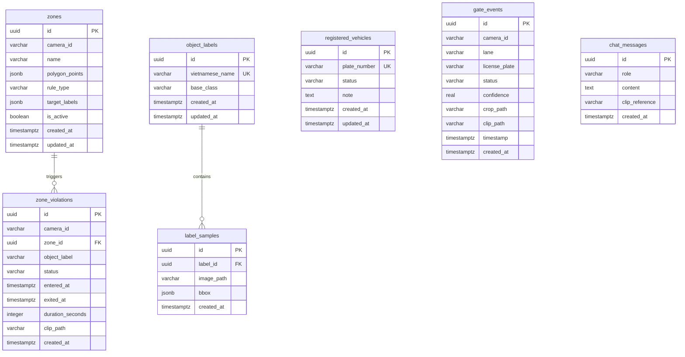

# SentriAI — Database Specification

## 1. Scope and Sources

**Product:** `docs/product/product.md` — Đã duyệt (HuuThuan, 2026-08-17T14:43:00+07:00)  
**Architecture:** `docs/architecture/architecture.md` — Đã duyệt (2026-08-17)  
**Database engine:** PostgreSQL (Neon cloud, phiên bản 15/16)  
**Existing schema sources:** None — greenfield  

**In scope:**
- Lưu trữ danh mục biển số xe đã đăng ký và phân loại quen/lạ phục vụ đối chiếu LPR (M1, M3).
- Lưu trữ lịch sử sự kiện nhận diện xe tại cổng ra vào kèm ảnh cắt biển số và clip 10s (M1).
- Lưu trữ cấu hình vùng giám sát đa giác (polygon), quy tắc cấm/cho phép đối tượng theo camera (M2, M3).
- Lưu trữ sự kiện vi phạm khu vực (thời điểm vào/ra, duration, clip 10s) (M2).
- Lưu trữ danh mục nhãn đối tượng tiếng Việt và mẫu ảnh/annotation gán nhãn (M3).
- Lưu trữ lịch sử câu hỏi/trả lời của trợ lý AI Q&A kèm tham chiếu clip (M4).

**Out of scope:**
- Phân quyền người dùng, bảng phân vai trò (Admin / Bảo vệ / Viewer) — MVP là single user local.
- Làn xe ra (OUT lane), bảng phân ca trực bảo vệ.
- Quản lý đa tổ chức / multi-site (multi-tenancy).

---

## 2. Resolved Decisions

1. **Cấu trúc sự kiện:** Tách thành 2 bảng chuyên biệt `gate_events` và `zone_violations` để đảm bảo kiểu dữ liệu chặt chẽ và tối ưu truy vấn nghiệp vụ.
2. **Cấu trúc Zone & Rules:** Lưu tập trung tọa độ polygon và cấu hình quy tắc trong bảng `zones` dưới dạng `jsonb` để hỗ trợ đẩy cấu hình real-time và nạp nhanh vào Python Worker/React Canvas.
3. **Lưu trữ Chat Q&A:** Thêm bảng `chat_messages` để lưu trữ bền vững lịch sử hỏi đáp AI và đường dẫn clip tham chiếu.
4. **`object_labels.base_class` không unique:** Nhiều tên tiếng Việt (e.g. "Xe máy" và "Mô tô") có thể cùng map về một class YOLO gốc (e.g. `motorcycle`). Không thêm unique constraint trên `base_class`; Python Worker sử dụng `vietnamese_name` làm khóa tra cứu trong zone rules.
5. **Lịch sử chat hiển thị toàn bộ:** `chat_messages` lưu bền vững và hiển thị toàn bộ lịch sử qua các phiên khác nhau; không có `session_id`.

---

## 3. Logical Data Model

### RegisteredVehicle (Xe đăng ký)
- **Purpose:** Quản lý danh sách biển số đã biết để hệ thống đối chiếu gán nhãn `XE QUEN` hoặc `XE LẠ` khi xe vào cổng.
- **Owner/tenant:** Toàn hệ thống (single-tenant).
- **Identity:** Biển số xe (`plate_number`, unique).
- **Lifecycle:** Tạo/sửa/xóa thủ công từ màn hình Cài đặt (M3).
- **Relationships:** Đối chiếu logic với `gate_events` (không ép foreign key để tránh việc xóa xe làm mất tính toàn vẹn của log sự kiện cũ).
- **Source:** Product M1, M3; Rule BR-02.

### GateEvent (Sự kiện cổng)
- **Purpose:** Ghi nhận mỗi lượt xe đi vào làn IN tại cổng (biển số, độ tin cậy, phân loại quen/lạ, ảnh crop, video clip 10s).
- **Owner/tenant:** Camera GATE-01.
- **Identity:** Khóa chính định danh sự kiện (`id`).
- **Lifecycle:** Python Worker tạo mới khi xe vào zone làn IN; không sửa/xóa (append-only log).
- **Relationships:** Độc lập với bảng cấu hình xe.
- **Source:** Product M1, AC-02, BR-01, BR-05.

### Zone (Vùng giám sát & Quy tắc)
- **Purpose:** Định nghĩa các đa giác khu vực trên khung hình camera kèm danh sách quy tắc cấm/cho phép loại đối tượng.
- **Owner/tenant:** Gắn theo Camera (`camera_id` ví dụ: `BAI-KIEM`, `GATE-01`).
- **Identity:** Khóa chính `id` (UUID).
- **Lifecycle:** Tạo, sửa tọa độ/rules, bật/tắt kích hoạt từ màn hình Cài đặt (M3).
- **Relationships:** 1 Zone có thể có nhiều `zone_violations` (1:N).
- **Source:** Product M2, M3, BR-03, BR-04, BR-07.

### ZoneViolation (Sự kiện vi phạm khu vực)
- **Purpose:** Ghi nhận phiên đối tượng đi vào vùng cấm từ lúc vào đến lúc ra, tổng thời gian và clip 10s.
- **Owner/tenant:** Gắn với một Zone và Camera cụ thể.
- **Identity:** Khóa chính `id` (UUID).
- **Lifecycle:** Python Worker tạo khi phát hiện vi phạm (`status = 'OPEN'`), cập nhật `exited_at` + `duration_seconds` + `status = 'CLOSED'` khi đối tượng rời zone.
- **Relationships:** N:1 với `zones`.
- **Source:** Product M2, AC-04, BR-05, BR-06.

### ObjectLabel (Danh mục nhãn đối tượng)
- **Purpose:** Định nghĩa tên tiếng Việt tương ứng với các class gốc của model YOLO (ví dụ: `xe_nang` -> "Xe nâng").
- **Owner/tenant:** Toàn hệ thống.
- **Identity:** `vietnamese_name` (unique).
- **Lifecycle:** Tạo/sửa/xóa từ màn hình Cài đặt gán nhãn (M3).
- **Relationships:** 1 ObjectLabel có nhiều `label_samples` (1:N).
- **Source:** Product M3, AC-06; Q2.

### LabelSample (Mẫu ảnh gán nhãn)
- **Purpose:** Lưu trữ đường dẫn ảnh và tọa độ bounding box đã vẽ phục vụ lưu trữ tập dữ liệu mẫu.
- **Owner/tenant:** Thuộc về một `ObjectLabel`.
- **Identity:** Khóa chính `id` (UUID).
- **Lifecycle:** Tạo từ tool vẽ bbox gán nhãn (M3), xóa khi xóa nhãn cha (cascade).
- **Relationships:** N:1 với `object_labels`.
- **Source:** Product M3, Mục 8 Success metrics (>= 20 mẫu/loại).

### ChatMessage (Lịch sử hỏi đáp AI)
- **Purpose:** Lưu lại lịch sử câu hỏi của người dùng và câu trả lời kèm tham chiếu video clip từ Gemini Q&A.
- **Owner/tenant:** Toàn hệ thống.
- **Identity:** Khóa chính `id` (UUID).
- **Lifecycle:** Tạo mới khi user gửi câu hỏi và khi AI hoàn thành câu trả lời (append-only).
- **Relationships:** Độc lập.
- **Source:** Product M4, Q&A Chat.

---

## 4. Mermaid ERD

---

## 5. Table Specifications

### `registered_vehicles`

**MVP justification:** Quản lý danh sách biển số để hệ thống phân biệt `XE QUEN` và `XE LẠ` theo Product M1, M3.  
**Owner/tenant:** System-wide (Single-tenant).  
**Lifecycle:** Thêm, sửa trạng thái/ghi chú, xóa từ UI Cài đặt.

| Column | Engine type | Null | Default | Key | Meaning/source |
|---|---|---|---|---|---|
| `id` | `uuid` | No | `gen_random_uuid()` | PK | Định danh bản ghi |
| `plate_number` | `varchar(20)` | No | None | UK | Biển số xe (chuẩn hóa không dấu, viết hoa) |
| `status` | `varchar(20)` | No | `'KNOWN'` | | Phân loại: `'KNOWN'` (Xe quen), `'STRANGER'` (Xe lạ) |
| `note` | `text` | Yes | `NULL` | | Ghi chú người sở hữu / loại xe |
| `created_at` | `timestamptz` | No | `now()` | | Thời điểm đăng ký |
| `updated_at` | `timestamptz` | No | `now()` | | Thời điểm cập nhật cuối |

- **Primary key:** `id`
- **Unique constraints:** `uq_registered_vehicles_plate_number` (`plate_number`)
- **Check constraints:** `chk_registered_vehicles_status`: `status IN ('KNOWN', 'STRANGER')`
- **Indexes:** Backing unique index trên `plate_number` (phục vụ đối chiếu LPR tốc độ cao theo **AP-01**).
- **Sensitive-data notes:** Biển số xe nội bộ; lưu trữ trực tiếp.

---

### `gate_events`

**MVP justification:** Ghi nhật ký mọi lượt xe qua cổng kèm ảnh cắt và clip 10s theo Product M1 (AC-02).  
**Owner/tenant:** Gắn theo camera cổng (`GATE-01`).  
**Lifecycle:** Append-only log. Được tạo bởi Python AI Worker khi xe đi qua làn IN.

| Column | Engine type | Null | Default | Key | Meaning/source |
|---|---|---|---|---|---|
| `id` | `uuid` | No | `gen_random_uuid()` | PK | Định danh sự kiện cổng |
| `camera_id` | `varchar(50)` | No | None | | Mã định danh camera (`'GATE-01'`) — Worker phải truyền tường minh |
| `lane` | `varchar(20)` | No | None | | Làn xe di chuyển: `'IN_1'`, `'IN_2'` |
| `license_plate` | `varchar(20)` | No | None | | Biển số xe nhận diện được |
| `status` | `varchar(20)` | No | None | | Trạng thái đối chiếu: `'KNOWN'` hoặc `'STRANGER'` |
| `confidence` | `real` | No | None | | Độ tin cậy nhận diện OCR (0.0 đến 1.0) |
| `crop_path` | `varchar(500)` | Yes | `NULL` | | Đường dẫn file ảnh cắt biển số trên disk |
| `clip_path` | `varchar(500)` | Yes | `NULL` | | Đường dẫn file video MP4 10s trên disk |
| `timestamp` | `timestamptz` | No | `now()` | | Thời điểm xe xuất hiện trong zone |
| `created_at` | `timestamptz` | No | `now()` | | Thời điểm ghi bản ghi vào DB |

- **Primary key:** `id`
- **Foreign keys:** None (để log sự kiện độc lập)
- **Check constraints:**
  - `chk_gate_events_lane`: `lane IN ('IN_1', 'IN_2')`
  - `chk_gate_events_status`: `status IN ('KNOWN', 'STRANGER')`
  - `chk_gate_events_confidence`: `confidence >= 0.0 AND confidence <= 1.0`
- **Indexes:**
  - `idx_gate_events_timestamp_desc` (`timestamp DESC`) — phục vụ **AP-02** (Alert panel & Live query).
  - `idx_gate_events_license_plate` (`license_plate`) — phục vụ **AP-03** (Tra cứu theo biển số).
  - `idx_gate_events_status_timestamp` (`status`, `timestamp DESC`) — phục vụ **AP-04** (AI Q&A: đếm xe lạ hôm nay).
- **Sensitive-data notes:** Đường dẫn media trỏ tới filesystem local (`data/crops/`, `data/clips/`).

---

### `zones`

**MVP justification:** Quản lý tọa độ đa giác và quy tắc kiểm tra vi phạm theo Product M2, M3.  
**Owner/tenant:** Thuộc camera tương ứng (`camera_id`).  
**Lifecycle:** Tạo, chỉnh sửa, bật/tắt từ màn hình Cài đặt (M3).

| Column | Engine type | Null | Default | Key | Meaning/source |
|---|---|---|---|---|---|
| `id` | `uuid` | No | `gen_random_uuid()` | PK | Định danh vùng giám sát |
| `camera_id` | `varchar(50)` | No | None | | Camera áp dụng (`BAI-KIEM`, `GATE-01`) |
| `name` | `varchar(100)` | No | None | | Tên vùng (ví dụ: "Khu vực cấm xe máy") |
| `polygon_points` | `jsonb` | No | None | | Danh sách tọa độ normalized: `[{"x":0.1,"y":0.2},...]` |
| `rule_type` | `varchar(50)` | No | `'PROHIBIT_SPECIFIED'` | | Kiểu quy tắc: `'PROHIBIT_SPECIFIED'` (cấm danh sách chỉ định), `'ALLOW_SPECIFIED'` (chỉ cho phép danh sách, còn lại cấm) |
| `target_labels` | `jsonb` | No | `'[]'::jsonb` | | Danh sách nhãn đối tượng áp dụng rule: `["xe_may", "nguoi"]` |
| `is_active` | `boolean` | No | `true` | | Trạng thái kích hoạt giám sát |
| `created_at` | `timestamptz` | No | `now()` | | Thời điểm tạo |
| `updated_at` | `timestamptz` | No | `now()` | | Thời điểm cập nhật cuối |

- **Primary key:** `id`
- **Unique constraints:** `uq_zones_camera_name` (`camera_id`, `name`) — tránh 2 zone trùng tên trên cùng camera; bắt buộc khi UI dùng tên zone để phân biệt.
- **Check constraints:** `chk_zones_rule_type`: `rule_type IN ('PROHIBIT_SPECIFIED', 'ALLOW_SPECIFIED')`
- **Indexes:**
  - `idx_zones_camera_active` (`camera_id`, `is_active`) — phục vụ **AP-05** (Python Worker nạp zone đang active).
- **Sensitive-data notes:** None.

---

### `zone_violations`

**MVP justification:** Ghi nhận sự kiện vi phạm khu vực (thời điểm vào/ra, duration, clip 10s) theo Product M2.  
**Owner/tenant:** Thuộc về một `Zone` và `Camera`.  
**Lifecycle:** Tạo khi đối tượng vào vùng cấm (`status = 'OPEN'`), cập nhật `exited_at` + `duration_seconds` + `status = 'CLOSED'` khi đối tượng ra khỏi vùng.

| Column | Engine type | Null | Default | Key | Meaning/source |
|---|---|---|---|---|---|
| `id` | `uuid` | No | `gen_random_uuid()` | PK | Định danh sự kiện vi phạm |
| `camera_id` | `varchar(50)` | No | None | | Mã camera xảy ra vi phạm (`'BAI-KIEM'`) — Worker phải truyền tường minh |
| `zone_id` | `uuid` | No | None | FK | Vùng giám sát bị vi phạm |
| `object_label` | `varchar(100)` | No | None | | Tên nhãn đối tượng vi phạm (hoặc `'CHƯA XÁC ĐỊNH'`) |
| `status` | `varchar(20)` | No | `'OPEN'` | | Trạng thái sự kiện: `'OPEN'` (đang ở trong zone), `'CLOSED'` (đã rời khỏi zone) |
| `entered_at` | `timestamptz` | No | `now()` | | Thời điểm đối tượng đi vào zone |
| `exited_at` | `timestamptz` | Yes | `NULL` | | Thời điểm đối tượng rời khỏi zone |
| `duration_seconds` | `integer` | Yes | `NULL` | | Tổng thời gian lưu lại trong zone (giây) |
| `clip_path` | `varchar(500)` | Yes | `NULL` | | Đường dẫn video MP4 10s lưu từ lúc vào |
| `created_at` | `timestamptz` | No | `now()` | | Thời điểm tạo bản ghi |

- **Primary key:** `id`
- **Foreign keys:** `fk_zone_violations_zone_id`: `zone_id` REFERENCES `zones(id)` ON DELETE RESTRICT ON UPDATE CASCADE
- **Check constraints:**
  - `chk_zone_violations_status`: `status IN ('OPEN', 'CLOSED')`
  - `chk_zone_violations_duration`: `duration_seconds IS NULL OR duration_seconds >= 0`
- **Indexes:**
  - `idx_zone_violations_entered_at_desc` (`entered_at DESC`) — phục vụ **AP-02** (Alert panel & Timeline).
  - `idx_zone_violations_zone_entered` (`zone_id`, `entered_at DESC`) — phục vụ **AP-06** (AI Q&A: tra cứu vi phạm theo zone).
  - `idx_zone_violations_active_tracking` (`zone_id`, `status`) — phục vụ Python Worker kiểm tra vi phạm đang mở để tránh spam alert lặp (BR-06).
- **Sensitive-data notes:** Clip trỏ tới filesystem local (`data/clips/`).

---

### `object_labels`

**MVP justification:** Quản lý danh mục tên tiếng Việt ánh xạ tới class model gốc theo Product M3 (Q2, AC-06).  
**Owner/tenant:** Toàn hệ thống.  
**Lifecycle:** Thêm/sửa/xóa từ UI Cài đặt gán nhãn.

| Column | Engine type | Null | Default | Key | Meaning/source |
|---|---|---|---|---|---|
| `id` | `uuid` | No | `gen_random_uuid()` | PK | Định danh nhãn |
| `vietnamese_name` | `varchar(100)` | No | None | UK | Tên nhãn tiếng Việt (ví dụ: "Xe máy", "Xe nâng") |
| `base_class` | `varchar(50)` | No | None | | Class tương ứng trong model gốc (ví dụ: "motorcycle", "truck") |
| `created_at` | `timestamptz` | No | `now()` | | Thời điểm tạo |
| `updated_at` | `timestamptz` | No | `now()` | | Thời điểm cập nhật |

- **Primary key:** `id`
- **Unique constraints:** `uq_object_labels_vietnamese_name` (`vietnamese_name`)
- **Indexes:** Backing index unique trên `vietnamese_name`.
- **Sensitive-data notes:** None.

---

### `label_samples`

**MVP justification:** Lưu trữ các mẫu ảnh và tọa độ bbox đã gắn nhãn trong màn hình Cài đặt theo Product M3.  
**Owner/tenant:** Thuộc về một `ObjectLabel`.  
**Lifecycle:** Thêm từ UI gán nhãn; tự động xóa nếu nhãn cha bị xóa (Cascade).

| Column | Engine type | Null | Default | Key | Meaning/source |
|---|---|---|---|---|---|
| `id` | `uuid` | No | `gen_random_uuid()` | PK | Định danh mẫu gán nhãn |
| `label_id` | `uuid` | No | None | FK | Nhãn đối tượng được gán |
| `image_path` | `varchar(500)` | No | None | | Đường dẫn ảnh mẫu lưu trên disk |
| `bbox` | `jsonb` | No | None | | Tọa độ bbox: `{"x": 0.1, "y": 0.2, "w": 0.3, "h": 0.4}` |
| `created_at` | `timestamptz` | No | `now()` | | Thời điểm gán nhãn |

- **Primary key:** `id`
- **Foreign keys:** `fk_label_samples_label_id`: `label_id` REFERENCES `object_labels(id)` ON DELETE CASCADE ON UPDATE CASCADE
- **Indexes:**
  - `idx_label_samples_label_id` (`label_id`) — lọc các mẫu theo nhãn khi mở màn hình gán nhãn, phục vụ **AP-07**.
- **Sensitive-data notes:** None.

---

### `chat_messages`

**MVP justification:** Lưu lịch sử các câu hỏi, câu trả lời và tham chiếu video clip của module AI Q&A theo Product M4.  
**Owner/tenant:** Toàn hệ thống.  
**Lifecycle:** Append-only log. Tạo khi user hỏi và khi AI sinh câu trả lời.

| Column | Engine type | Null | Default | Key | Meaning/source |
|---|---|---|---|---|---|
| `id` | `uuid` | No | `gen_random_uuid()` | PK | Định danh tin nhắn |
| `role` | `varchar(20)` | No | None | | Vai trò: `'user'` hoặc `'assistant'` |
| `content` | `text` | No | None | | Nội dung câu hỏi hoặc câu trả lời |
| `clip_reference` | `varchar(500)` | Yes | `NULL` | | Đường dẫn clip tham chiếu (nếu có) |
| `created_at` | `timestamptz` | No | `now()` | | Thời điểm gửi |

- **Primary key:** `id`
- **Check constraints:** `chk_chat_messages_role`: `role IN ('user', 'assistant')`
- **Indexes:**
  - `idx_chat_messages_created_at_asc` (`created_at ASC`) — tải lịch sử tin nhắn theo thứ tự thời gian.
- **Sensitive-data notes:** None.

---

## 6. Relationships and Cardinality

| Parent | Child | Cardinality | Required? | FK Column | Delete/update behavior | Source |
|---|---|---|---|---|---|---|
| `zones` | `zone_violations` | 1:N | Yes | `zone_id` | ON DELETE RESTRICT / ON UPDATE CASCADE | Product M2 |
| `object_labels` | `label_samples` | 1:N | Yes | `label_id` | ON DELETE CASCADE / ON UPDATE CASCADE | Product M3 |

*(Lưu ý: `registered_vehicles` và `gate_events` được cố ý phân tách không dùng FK cứng để đảm bảo việc sửa/xóa biển số đăng ký không làm ảnh hưởng tính toàn vẹn của lịch sử sự kiện đã ghi).*

---

## 7. Access Patterns and Indexes

### AP-01 — Đối chiếu LPR tức thì (Gate LPR matching)
- **Source:** Luồng nhận diện xe tại cổng (Product M1, BR-02).
- **Filter/join/sort:** `SELECT status FROM registered_vehicles WHERE plate_number = :plate_number LIMIT 1`
- **Index:** `uq_registered_vehicles_plate_number` (`plate_number`)
- **Why:** Phục vụ tra cứu biển số dưới 5ms ngay khi xe vào làn IN.

### AP-02 — Danh sách cảnh báo thời gian thực (Alert panel & Live feed)
- **Source:** Hiển thị alert panel và timeline sự kiện mới nhất (Product M1, M2).
- **Filter/join/sort:** `SELECT * FROM gate_events ORDER BY timestamp DESC LIMIT 20`, `SELECT * FROM zone_violations ORDER BY entered_at DESC LIMIT 20`
- **Indexes:** `idx_gate_events_timestamp_desc` (`timestamp DESC`), `idx_zone_violations_entered_at_desc` (`entered_at DESC`)
- **Why:** Tối ưu truy vấn các sự kiện vừa xảy ra để render alert panel.

### AP-03 — Tìm kiếm sự kiện cổng theo biển số
- **Source:** AI Q&A hoặc tra cứu lịch sử cổng (Product M4).
- **Filter/join/sort:** `SELECT * FROM gate_events WHERE license_plate = :plate ORDER BY timestamp DESC`
- **Index:** `idx_gate_events_license_plate` (`license_plate`)
- **Why:** Tránh full-table scan khi AI hoặc người dùng tra cứu lịch sử một biển số cụ thể.

### AP-04 — Thống kê xe lạ / xe quen trong ngày (AI Q&A Tool)
- **Source:** Câu hỏi mẫu M4: *"Hôm nay có bao nhiêu xe lạ vào?"* (AC-07).
- **Filter/join/sort:** `SELECT COUNT(*) FROM gate_events WHERE status = 'STRANGER' AND timestamp >= :start_of_day AND timestamp < :end_of_day`
- **Index:** `idx_gate_events_status_timestamp` (`status`, `timestamp DESC`)
- **Why:** Hỗ trợ Gemini function calling đếm số lượng xe lạ theo khoảng thời gian nhanh chóng.

### AP-05 — Nạp cấu hình vùng giám sát hoạt động (Worker sync)
- **Source:** Python AI Worker khởi động hoặc poll cấu hình zone mỗi 5s (Architecture 6.2).
- **Filter/join/sort:** `SELECT * FROM zones WHERE camera_id = :camera_id AND is_active = true`
- **Index:** `idx_zones_camera_active` (`camera_id`, `is_active`)
- **Why:** Python Worker chỉ cần nạp các zone đang active của từng camera.

### AP-06 — Thống kê vi phạm theo vùng và khoảng thời gian (AI Q&A Tool)
- **Source:** Câu hỏi mẫu M4: *"Có xe máy nào vào khu cấm không?", "Xe máy ở trong khu cấm bao lâu?"*
- **Filter/join/sort:** `SELECT * FROM zone_violations WHERE zone_id = :zone_id AND entered_at >= :start_time`
- **Index:** `idx_zone_violations_zone_entered` (`zone_id`, `entered_at DESC`)
- **Why:** Hỗ trợ Gemini function calling tính toán thời lượng và số lượt vi phạm của từng zone.

### AP-07 — Tải danh sách mẫu ảnh theo nhãn (Settings — Label tool)
- **Source:** Màn hình Cài đặt nhãn đối tượng (Product M3, AC-06): load các mẫu đã gắn nhãn khi user chọn nhãn để xem/thêm.
- **Filter/join/sort:** `SELECT * FROM label_samples WHERE label_id = :label_id ORDER BY created_at ASC`
- **Index:** `idx_label_samples_label_id` (`label_id`)
- **Why:** Tránh full-table scan khi label_samples tích lũy nhiều mẫu (≥ 20 mẫu/nhãn × ≥ 5 nhãn theo success metrics).

---

## 8. Data Rules

- **Ownership & Tenancy:** Single-tenant, local runtime; toàn bộ dữ liệu thuộc một hệ thống duy nhất.
- **Identity & Uniqueness:** Tất cả các bảng sử dụng UUID v4 làm khóa chính. `registered_vehicles.plate_number` và `object_labels.vietnamese_name` là duy nhất. `zones.(camera_id, name)` là duy nhất trong phạm vi camera.
- **`object_labels.base_class` không unique:** Nhiều tên tiếng Việt có thể cùng trỏ tới một class YOLO gốc (e.g. "Xe máy" và "Mô tô" → `motorcycle`). Python Worker phải dùng `vietnamese_name` làm khóa tra cứu zone rules, không dùng `base_class`.
- **Valid states & Invariants:**
  - `gate_events.status` chỉ nhận `'KNOWN'` hoặc `'STRANGER'`.
  - `gate_events.lane` chỉ nhận `'IN_1'` hoặc `'IN_2'`.
  - `zone_violations.status` nhận `'OPEN'` khi bắt đầu vi phạm và `'CLOSED'` khi đối tượng đã ra khỏi zone.
  - `zone_violations.duration_seconds` chỉ được tính và cập nhật khi `status = 'CLOSED'`.
- **Deletion & Cascade:**
  - Không cho phép xóa `zones` nếu đang có dữ liệu `zone_violations` (`ON DELETE RESTRICT`).
  - Xóa `object_labels` sẽ tự động xóa các `label_samples` liên quan (`ON DELETE CASCADE`).
- **Retention & Media:** Video clip và ảnh crop được lưu trên local filesystem (`/data/clips/`, `/data/crops/`), database chỉ lưu đường dẫn tương đối. Nếu ghi file thất bại, đường dẫn lưu `NULL` và sự kiện vẫn được ghi thành công (đáp ứng BR-05).
- **Chat history persistence:** `chat_messages` lưu bền vững và hiển thị toàn bộ lịch sử qua các phiên khác nhau; không có session boundary trong MVP.
- **Timezone:** Toàn bộ cột timestamp sử dụng `TIMESTAMPTZ` (UTC / lưu kèm múi giờ).

---

## 9. Current State and Delta

`Current State and Delta: Not applicable — greenfield`

---

## 10. Implementation Handoff Checklist

- [x] Database engine và phiên bản được xác định rõ ràng: PostgreSQL (Neon cloud).
- [x] Bảng, cột, kiểu dữ liệu engine-specific, nullability và giá trị mặc định đầy đủ.
- [x] Primary keys, Foreign keys, Unique constraints, Check constraints đầy đủ.
- [x] Các hành vi tham chiếu (Referential actions ON DELETE/UPDATE) được khai báo cụ thể.
- [x] Mọi index đều gắn liền với một Access Pattern ID rõ ràng.
- [x] Quy tắc về dữ liệu, trạng thái, vòng đời và lưu trữ media được làm rõ.
- [x] Không còn giả định hay blocker nào chưa được giải quyết.
- [x] Không chứa mã triển khai ORM, DDL, SQL migration hay code backend (tuân thủ blind handoff).
